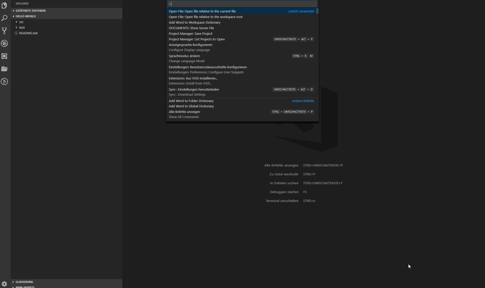
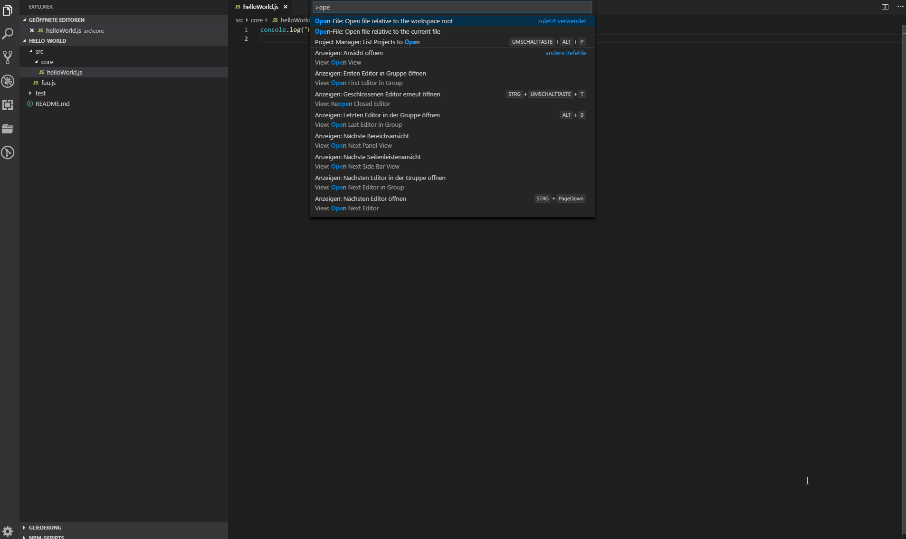
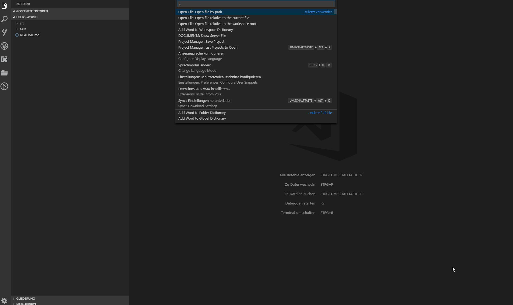
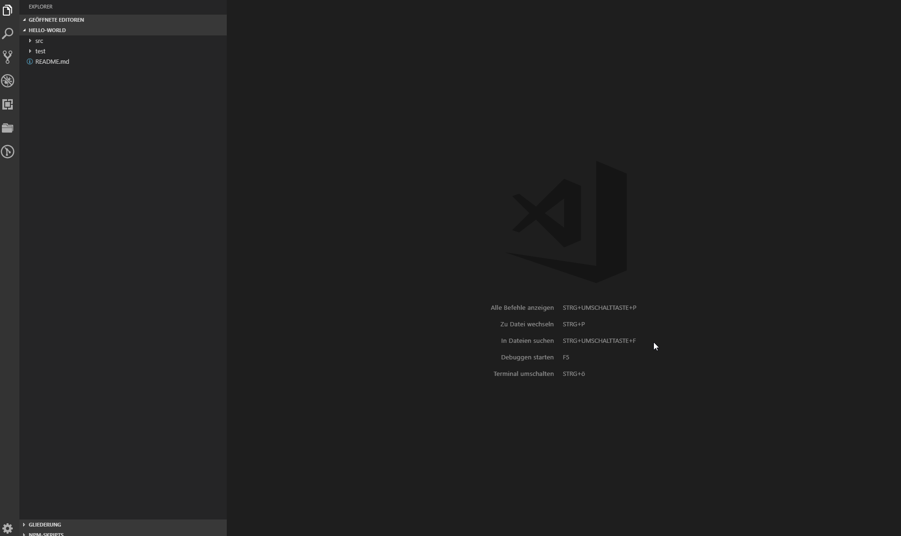

# File Picker

This extension allows you to open a file by navigating through the file tree relative to the workspace or the opened file.

# Why?
Depending on your workspace settings the integrated file picker (`ctrl+e`) does not display all available files in your workspace,
e.g. files in the node_modules- or bower_components-folder.

If you are as lazy as me, you don't want to move your hands from the keyboard to the mouse to open a file which is not selectable
by the integrated file picker. With this extension, you can open any file just by navigating through the quick pick dialog or by
enter the file path by yourself.

# Relative to workspace

# Relative to current file

# Open file by path
## Relative

## Absolute

